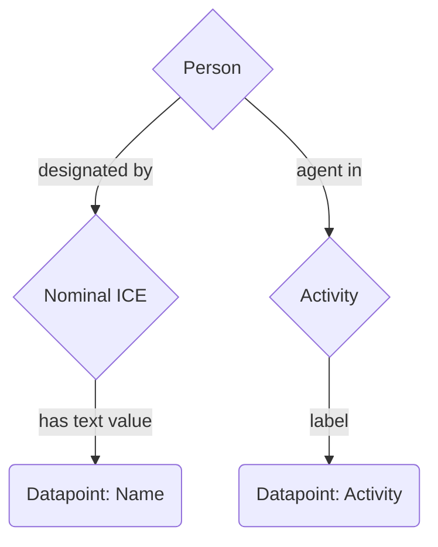

# CSV_to_RDF_Instance_tool
A tool for turning CSV into RDF with complex mappings. This tool speeds up the process of creating scripts to generate RDF data from CSVs. The burden of learning RDFLib syntax is eased slightly when making a mapping file like those in this directory. While it is important to understand the syntax of RDFLib classes and functions like `URIRef()` and `Literal()`, this script makes it easier to translate graphs into mappings for data.

# Usage and Syntax

The function takes a (1) mapping csv, (2) instance data csv, and (3) prefix dictionary as core arguments. Optionally, if the `uuid_or_hex` argument is set to false, the function will use hexadecimal strings (which don't have hyphens) rather than standard random uuid strings (which do have hyphens).

This syntax assumes that you have a full worked-out knowledge graph mapping of your data you can use to construct the mapping file. Every triple in a knowledge graph mapping must be explicitly asserted--A1 is type A, A1 participates in B1, B1 is type B, and so on. Type assertions with `rdf:type` will assume that the subject of the triple is an instance, and add the triple `[YOUR SUBJECT HERE] rdf:type owl:NamedIndividual` to the graph. The mapping file must be a CSV and the first row must be `s,p,o` for subject, predicate, object.

Any prefixes used in the mapping must be passed into the function in a dictionary, with the following syntax:

```
prefix_dict = { 'ex:' : 'http://example.com/' , 'rdf:' 'http://www.w3.org/1999/02/22-rdf-syntax-ns#' }
```


## Example

The following is an example of a simple mapping.

```csv
s,p,o
ex:Person_1,RDF:type,ex:Person
ex:Person_1,RDFS:label,datapoint/string/Name
ex:Person_1,ex:agent_in,ex:Process_1
ex:Process_1,RDF:type,ex:Process
ex:Process_1,RDFS:label,datapoint/string/Activity
```
A corresponding csv of the data would look like this:
```csv
Name,Activity
John,Teaching
Mark,Thinking
Sally,Working
```
With this diagram showing where the datapoints connect to the graph:


This is a mapping that takes two datapoints, one which is the `rdfs:label` for the set of people, and another which is the `rdfs:label` for the activities those people are `ex:agent_in`.

To connect a triple to a column in a csv, the following syntax is used:
`datapoint/datatype/column` where `datatype` is a valid `xsd:datatype` and `column` is the name of a column in the csv.

In previous versions, the mapping and data generating happened in two steps. Now it happens in one.
